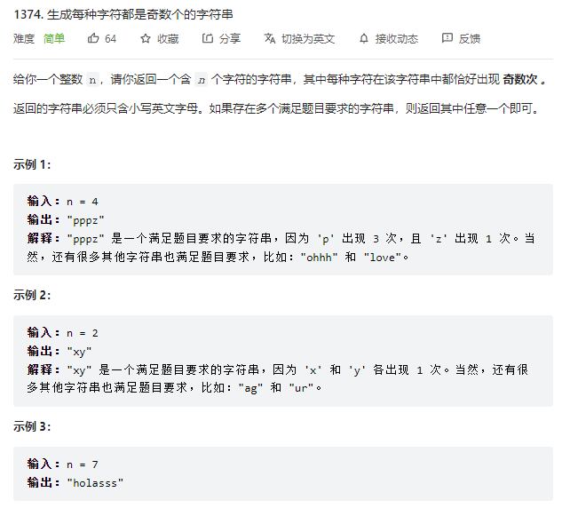

# 2022.8.1 生成每种字符都是奇数个的字符串
## 题目

## 解题思路
1.判断n是否为偶数
如果是偶数，那么先添加一个a,并将n-1变为奇数
2.增加n个b
## 代码
class Solution {
public:
    string generateTheString(int n) {
        string ret;
        if (n%2 == 0){
            ret = "a";
            n--;
        }
        for (int i = 0; i < n; i++){
            ret += 'b';
        }
        return ret;
    }
    
};
## 题解中的更优解
无。
## 力扣网址
https://leetcode.cn/problems/generate-a-string-with-characters-that-have-odd-counts/
