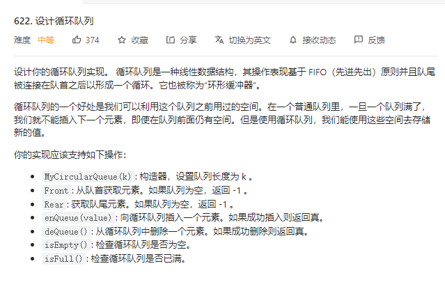

# 2022.8.2 设计循环队列
## 题目

## 解题思路
1. 使用vector 来代表队列，其中begin end表示队列头的下标和队列尾下标
2. 使用size来表示队列中存在多个数； maxSize代表队列最大容量
3. 判断为空 size ==0 则为空；判断队列是否已满 size == maxSize;
4. 插入一个进入队列 end 往后移一位，并且 end %maxSize 起到循环的效果
5. 从队列中删除一个元素， begin 往后移一位，并且 begin  %maxSize 起到循环的效果
6. Front 返回begin下标对应的值
6. Rear 返回end下标对应的值
## 代码
```
class MyCircularQueue {
public:
    int begin;
    int end;
    vector<int> que;
    int maxSize;
    int size;
    MyCircularQueue(int k) {
        begin =0;
        end =-1;
        maxSize = k;
        que.resize(k,0);
        size =0;        
    }
    
    bool enQueue(int value) {
        
        if (size == maxSize){
            return false;
        }
        size++;
        end =(end +1)%maxSize;
        que[end]=value;
        return true;
    }
    
    bool deQueue() {
        if (size ==0){
         return false;
        }
        size --;
        begin =(begin +1)%maxSize;
        return true;
    }
    
    int Front() {
        if (isEmpty()){
        return -1;
        }
        return que[begin];
    }
    
    int Rear() {
        if (isEmpty()){
        return -1;
        }
        else
        {
        return que[end];
        }
    }
    
    bool isEmpty() {
        return size ==0 ?true:false;
    }
    
    bool isFull() {
        if (size == maxSize)
            return true;
        else 
            return false;
    }
};

/**
 * Your MyCircularQueue object will be instantiated and called as such:
 * MyCircularQueue* obj = new MyCircularQueue(k);
 * bool param_1 = obj->enQueue(value);
 * bool param_2 = obj->deQueue();
 * int param_3 = obj->Front();
 * int param_4 = obj->Rear();
 * bool param_5 = obj->isEmpty();
 * bool vparam_6 = obj->isFull();
 */
 ```
## 题解中的更优解
无。
## 力扣网址
https://leetcode.cn/problems/design-circular-queue/