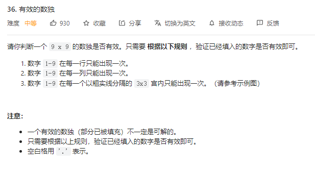
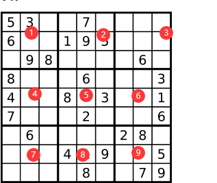

# No.36有效的数独
## 题目

## 解题思路
根据题意，总共需要判断三次是否符合规则
通过9位的bitset来辨识当前规则下是否出现重复，如果重复则直接返回false.
一次遍历 分别定义2个9位的bitset的数组（数组大小为9）和一个9位的Bitset来判断；
1.行是否符合规则，那么在遍历中，只要一个9位的bitset来判断是否重复
2.列是否符合规则，那么使用v1来标识列的规则，v1[j]代表第j列的bitset，如果出现重复则说明不符合规则。
3.3x3的九宫格是否符合规则，那么使用v2来表示，从左到右，从上到下 分别是(i/3)*3 可以表示在第几行的九宫格中，j/3可以表示在该行下的第几个九宫格。如下图

## 代码
class Solution {
public:
    bool isValidSudoku(vector<vector<char>>& board) {
        vector<bitset<9>> v1(9,0);
        vector<bitset<9>> v2(9,0);
        for (int i = 0;i<9;i++){
            bitset<9> bit;
            for (int j = 0; j< 9; j++){
                if (board[i][j]=='.')
                {
                    continue;
                }
                int a = board[i][j]-'1';
                 if (bit.test(a)){
                    return false;
                 }
                 else{
                    bit.set(a);
                 }
                 if (v1[j].test(a)){
                    return false;
                 }
                 else{
                     v1[j].set(a);
                 }
                 if (v2[(i/3)*3+j/3].test(a)){
                     return false;
                 }
                 else{
                     v2[(i/3)*3+j/3].set(a);
                 }
            }
        }
        return true;
    }
    
};
## 题解中的其他解或者最优解
bitset可以使用hash表或者数组来替代
## 力扣网址
https://leetcode.cn/problems/valid-sudoku/