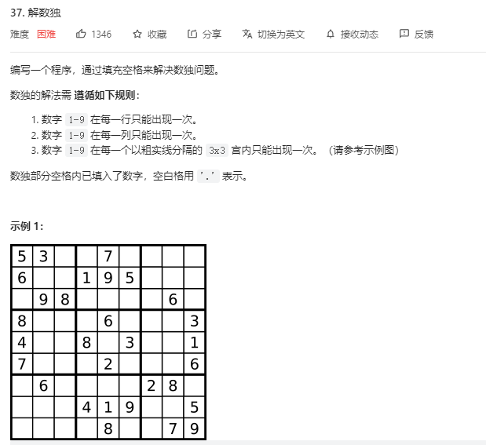

# No.37解数独
## 题目

## 解题思路
根据题意，总共需要判断三次是否符合规则
通过9位的bitset来辨识某一种规则（某一行、某一列、某一组）下是否出现重复，如果bitset.test(num)为true 说明已经存在这个数字，则代表出现了重复，不符合规则。
那么定义3个vector+bitset<9>来标记每行、每列或者每组中已包含的数字。
第一步： 将输入的九宫格中存在的数字进行标记。
第二步： 递归回溯的方法（FindSudoku函数）来对每一个'.'位置进行模拟填值。 该填入的数字应该符合题目中的规则（当前行、当前列、当前组不存在相同数字）
第三步: 如果递归到i=9,说明整个九宫格已经填充完毕，且其中都符合所有规则，则返回true，到solveSudoku中，其中board中的数组即为填充后的结果数组。
第四步： 如果当前位置所有值都填充后，仍不符合规则，则返回false,回溯到上一次递归处。

## 代码
```
class Solution {
public:
    vector<bitset<9>> v1,v2,v3;
    void solveSudoku(vector<vector<char>>& board) {
        v1.resize(9,0);
        v2.resize(9,0);
        v3.resize(9,0);
        for (int i = 0; i < 9; i++){
            for (int j = 0; j < 9; j++){
                if (board[i][j] != '.'){
                    int a = board[i][j] - '1';
                    v1[i].set(a);
                    v2[j].set(a);
                    v3[(i / 3) * 3 + j / 3].set(a);
                }
            }
        }
        FindSudoku(board, 0, 0);
    }

    bool FindSudoku(vector<vector<char>> & board, int i,int j){
        if (i == 9){
            return true;
        }
        if (j == 9){
            return FindSudoku(board, i+1,0);
        }
        if (board[i][j] != '.'){
            
            return FindSudoku(board, i,j+1);
        }
        for (int  k = 0; k < 9; k++) {
            if (v1[i].test(k)||
                v2[j].test(k)||
                v3[(i / 3) * 3 + j / 3].test(k)){
                    continue;
                }
            board[i][j] = k + '1';
             v1[i].set(k);
             v2[j].set(k);
                    v3[(i / 3) * 3 + j / 3].set(k);
            if (FindSudoku(board, i,j+1)){
                return true;
            }
            board[i][j] = '.';
             v1[i].reset(k);
             v2[j].reset(k);
                    v3[(i / 3) * 3 + j / 3].reset(k);
        }
        return false;

    }
};
```

## 题解中的其他解或者最优解
bitset可以使用hash表或者数组来替代
## 力扣网址
https://leetcode.cn/problems/sudoku-solver/solution/